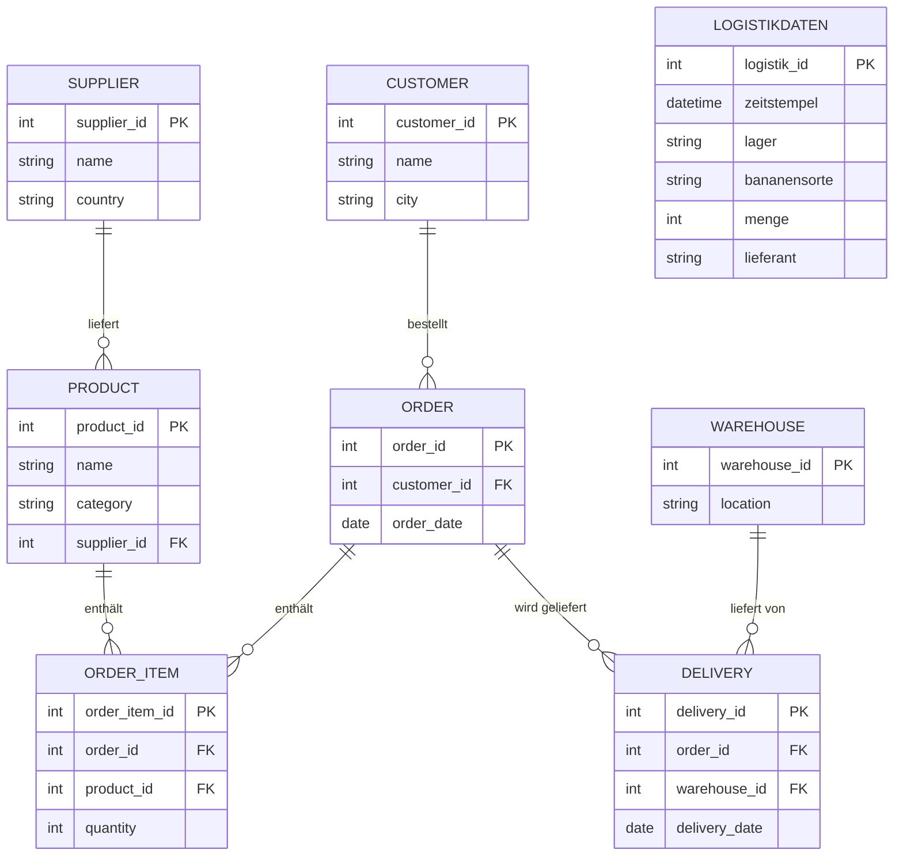

# ER-Modell für Bananen-Supply-Chain-System

## Entity-Relationship Diagramm

## Beziehungen im Detail:

1. **Lieferant → Produkt** (1:n): Ein Lieferant kann mehrere Produkte liefern
2. **Produkt → Bestellposition** (1:n): Ein Produkt kann in vielen Bestellpositionen vorkommen
3. **Kunde → Bestellung** (1:n): Ein Kunde kann mehrere Bestellungen aufgeben
4. **Bestellung → Bestellposition** (1:n): Eine Bestellung kann mehrere Positionen haben
5. **Bestellung → Lieferung** (1:n): Eine Bestellung kann mehrere Lieferungen haben
6. **Lager → Lieferung** (1:n): Ein Lager kann mehrere Lieferungen durchführen

## Logistikdaten:
Die Tabelle `logistikdaten` ist eine separate Entität, die zeitbasierte Logistikinformationen speichert und nicht direkt mit den anderen Entitäten verknüpft ist. 